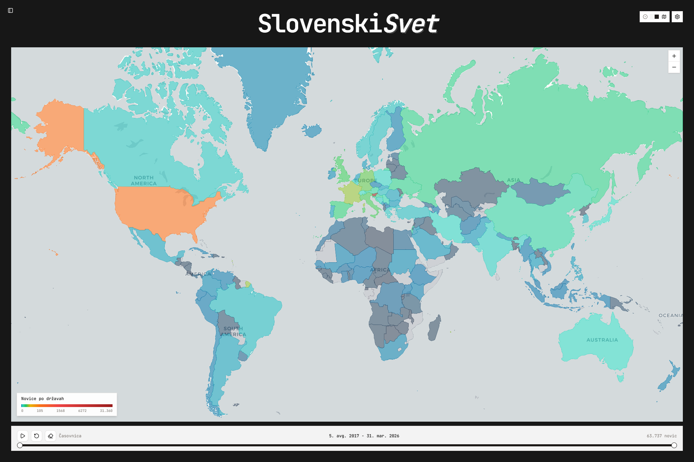
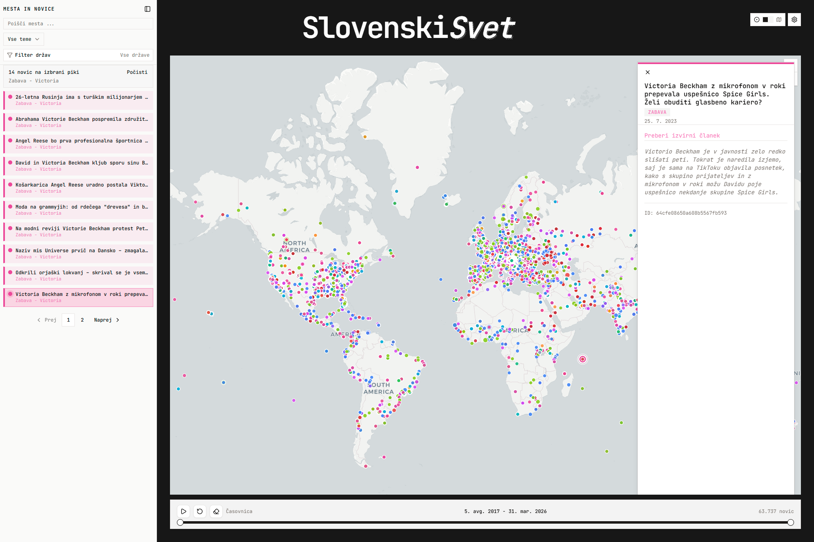
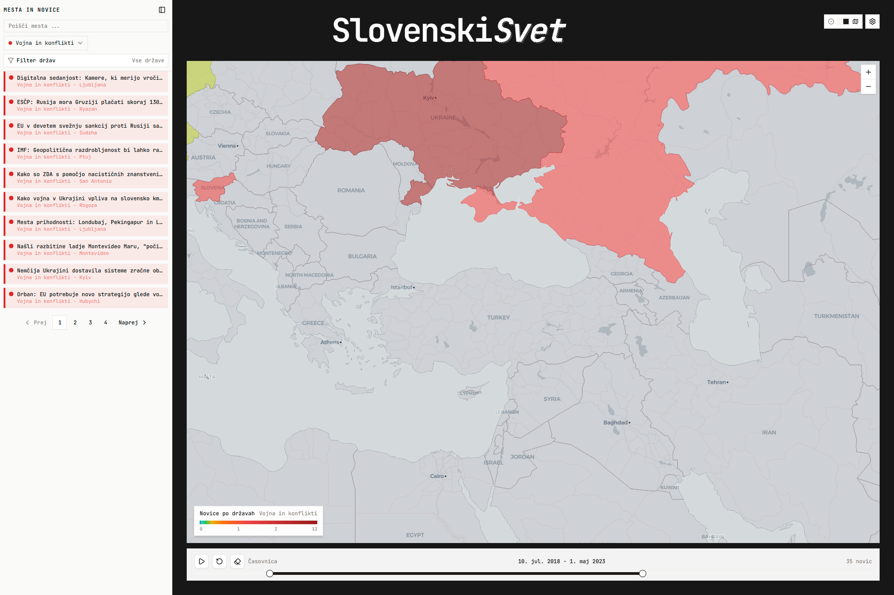
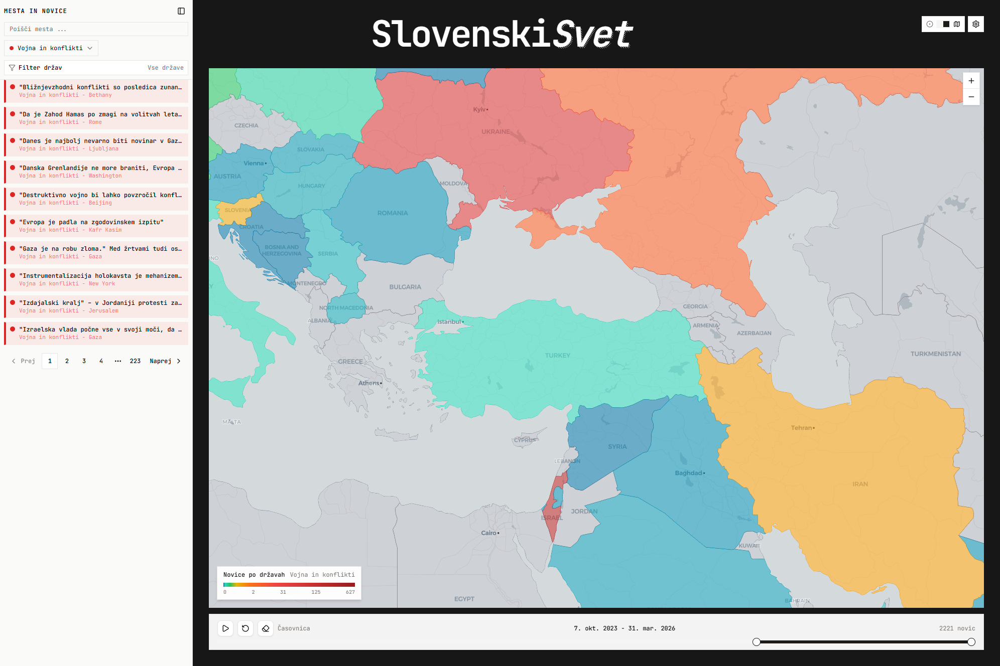
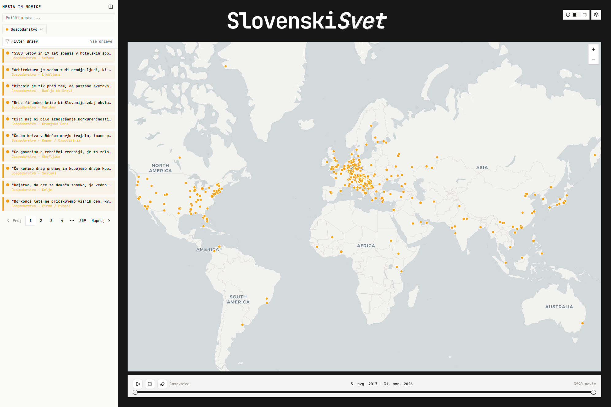

# Poročilo

## Povzetek:

Namen projekta je odkrivanje lokacije in tematske kategorije člankov MMC. Uporabljamo lokalno poganjano LLM storitev za ekstrakcijo strukturiranih oznak iz neurejenega besedila, rezultate pa primerjamo z ročno pripravljenim zlatim standardom (90 ročno označenih člankov). Cilj je razumeti, kako je pozornost novic razširjena preko držav in časa. O čem MMC govori, in kako intenzivno?

## 1. Uvod

- Namen: Odkrivanje pokritosti člankov po temah in lokaciji na mediju MMC. Analizirali bomo razporeditev tem in lokacij skozi čas in prikazali ugotovitve na interaktivnem zemljevidu, kar lahko pomaga pri uredniških odločitvah in nadaljnjih raziskavah.
- Metode: lokalnemu LLM modelu pošljemo novico z natančno oblikovanim promptom in ta vrne kombinacijo država-kraj in temo; dodatna orodja v repozitoriju združujejo, filtrirajo in pripevnajo LLM izhode.
- Prispevek tega poročila: jasno predstaviti pipeline, opisati uporabljene tehnike in metrike ter podrobno analizirati rezultate in napake na testni množici.

## 2. Podatki

- Vir: obdelani MMC zapisi (mapa `assets/cleaned` / `public`), posebna eval množica obstaja (pot potrditi).

V podatkovnem sklopu zajemamo izvorne MMC članke, ki jih nato očistimo in normaliziramo — ohranimo le ključna polja in metapodatke, da zagotovimo relevantnost informacij ter zmanjšamo šum v kontekstu, saj morajo biti prečiščeni podatki nadalje analizirani z LLM modelom. Na očiščenih besedilih izvajamo avtomatsko ekstrakcijo strukturiranih oznak, kot so glavna tema, država in kraj. Hkrati pripravimo podatke za prikaz z izbranimi značilkami iz surovih podatkov ter jim pripnemo rezultate analize LLM modela. Natančnost ocenjevanja preverjamo na ročno pripravljeni evalvacijski množici, nato pa na podlagi agregiranih rezultatov pripravljamo vizualizacije in metrike za analizo poročanja skozi čas in po lokacijah. Takšen pristop zagotavlja reproducibilen potek od surovih podatkov do interpretabilnih vpogledov in uredniških zaključkov.

Odkrit je bil tudi bias v podatkih - pred letom 2021 je zajetih bistveno manj člankov v vsakem mesecu, kot kasneje. Kako to vpliva na naše rezultate ni jasno, saj profesor ni omenil če so bili pred letom 2022 zajeti le določeni članki, in po kakšnem kriteriju so prišli v izbor.

## 3. Metode

Verzija 1:

- Prva izvedba projekta je vključevala uporabo LLM za ekstrakcijo (`topic`, `country`, `city`) iz očiščenih MMC zapisov. V promptu smo podali modelu seznam dovoljenih tem, s katerimi lahko označi članek. Potem je že sledila vizualizacija rezultatov v aplikaciji. Rezultati so bili tudi ovrednoteni na testni množici (ročno označeni primeri) za osnovno merjenje natančnosti.

Verzija 6 (trenutni pristop):

- `todo TJAS`

Opomba o odkrivanju znanja:

- Večina odkritij iz podatkov izhaja iz raziskovanja agregiranih izhodov preko vizualizacij (zemljevidi, časovne vrstice, tabele s pogostostmi). Vizualizacije pomagajo hitro identificirati vzorce, anomalije ipd.

## 4. Evalvacija LLM izhodov

Za evalvacijo LLM izhodov smo uporabili ročno označeno eval množico (n = 90). Osredotočili smo se na tri metrične kazalnike: exact-match za `topic`, exact-match za `country` in exact-match za `city` (city vrednotimo neodvisno od pravilne države).

### 4.1 Verzija 1 (V1)

- Topic (exact-match): 0.93
- City (exact-match): 0.94
- Country (exact-match): 0.84

### 4.2 Verzija 6 (V6)

- Topic (exact-match): 0.74
- City (exact-match): 0.70
- Country (exact-match): 0.76

### Opombe

- Za per class metrike nismo označili dovolj člankov, kajti imamo zelo veliko tem in bi bile vrednosti teh metrik nezanesljive.

### Primerjava in interpretacija

`todo TJAS` - ker ves kaj je v6 delal

- tuki je treba mal zagovarjat da je llm najbolsi za to kar smo mi zelel narest

## 5. Primeri odkrivanja znanj iz vizualizacij

Spodnji primeri prikazujejo, kako interaktivni zemljevid pretvori surov arhiv člankov v razumljive vzorce, ki jih iz seznama naslovov težko opazimo.

### 5.1 Globalna pokritost in lokalna natančnost

Preklapljanje med načini prikaza razkrije dva komplementarna pogleda na iste podatke.

- Heatmap (slika 1a) takoj pokaže, katere države prevladujejo v arhivu: ZDA, večje evropske države in Rusija so intenzivneje obarvane.
- Način pik (slika 1b) razkrije, da znotraj teh držav poročanje ni enakomerno porazdeljeno; novice se kopičijo v določenih mestih, druge regije pa ostajajo prazne.

| Slika 1a                                  | Slika 1b                                                  |
| ----------------------------------------- | --------------------------------------------------------- |
|  |  |

### 5.2 Geografska ločitev iste tematske kategorije

Ko izberemo filter "vojna & konflikti", zemljevid ne pokaže ene razmazane lise, temveč jasno ločena žarišča.

- Slika 2a prikazuje gosto pokritost vzhodne Evrope in Ukrajine.
- Slika 2b prikazuje intenzivno pokritost Bližnjega vzhoda.

Iz časovnega seznama bi težko takoj ugotovili, da isto tematsko oznako sestavljata dva povsem ločena geografska konflikta. Vizualizacija to razkrije brez branja posameznih člankov.

| Slika 2a                                             | Slika 2b                                                |
| ---------------------------------------------------- | ------------------------------------------------------- |
|  |  |

### 5.3 Odkrivanje uredniških praznin

Aplikacija ni uporabna le za potrjevanje očitnega, temveč tudi za odkrivanje česa ni. Ob izbiri teme "gospodarstvo" (slika 3) postane presenetljivo, kako redke so pike zunaj Evrope, Severne Amerike in vzhodne Azije. Veliki deli Afrike, Južne Amerike in Srednje Azije so skoraj prazni. To zahteva vprašanje, ali se gre za resnično manjše število ekonomskih dogodkov v teh regijah ali za uredniško pristranskost pri izbiranju virov? Vizualizacija samega seznama tega ne bi razkrila.

  
_Slika 3: Tematski filter "gospodarstvo" – opazna redkost zunaj tradicionalnih ekonomskih središč._

## 6. Refleksija

- LLM (verzija 1) je lahko vračal nesmiselne pare država-kraj, zato smo izgubili dokaj velik delež člankov (približno 50%).
- Zato smo poskusili tudi z drugačnim pristopom (verzija 6). Ta metoda je izgubila le 15% člankov, a so podatki manj točni.
- Za najboljše rezultate bi morali poganjati močnejši in dražji model, tako bi imeli več člankov in ohranili kvaliteto podatkov, ki jih model vrne.
